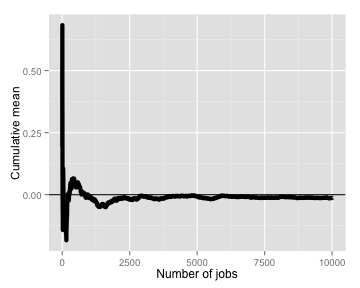

Exponential Distributions and the Central Limit Theorem
========================================================
### Author: Michael Downs


## Overview 
This document illustrates the properties of the exponential distribution. Specifically, it:
1. Simulates 1,000 samples of size n=40,
2. Compares sample and theoretical distribution means, and 
3. Compares sample and theoretical distribution variances.

### 1. Simulations
The following simulations generate samples from the exponential distribution whose probability density function (pdf) is given by: 
\[f(x;\lambda) = \begin{cases} \lambda e^{-\lambda x} & x \ge 0, \\ 0 & x < 0. \end{cases}\]
where $\lambda$ is the rate parameter (set to 0.2 for all simulations) and $\frac{1}{\lambda}$ is both the distribution mean and its standard deviation.

In this section, I sample 1,000 n=40 samples from the exponential distribution for subsequent use. 


```r
# generating a matrix of 1,000 rows of n=40 samples for subsequent calculations
nosim=1000; n=40
set.seed(123)
pop=matrix(rexp(nosim*n,rate=0.2),nosim)

# as a point of reference, here is the distribution of the entire population 
par(mfrow=c(1,2))
hist(rexp(pop,rate=0.2),main="'population' distribution")

# here is the distribution of a single sample
hist(rexp(pop[1,],rate=0.2),main="n=40 sample distribution") 
```

 

### 2. Compare sample and theoretical distribution means

Central Limit Thorem (CLT) states that the distribution of averages of IID variables becomes standard normal as the sample size increases.
\[\frac{\bar{X_n}-\mu}{\sigma/\sqrt{n}}=\frac{\sqrt{n}(\bar{X_n}-\mu)}{\sigma}=\frac{\text{Estimate - Mean of estimate}}{\text{Std. Err. of estimate}}\]
The implication for the mean is that, as the sample size grows to the limit, 1. the sample mean converges on the population mean, and 2. the distribution of the sample means will be normal (i.e., $\bar{X_n}\sim N(\mu,\sigma^2/n)$). I demonstrate this below in two ways:


```r
# 1. showing "consistency" between mathmatical population mean and the actual mean of samples:

### If CLT holds, the distibution of a large collection of sample means taken from an exponential distribution should be normal. Given that the standard normal distribution is centered on zero, the distribution of a NORMALIZED set of exponential distribution sample means should also center on zero. Accordingly, we:

### a. Generate a vector of 1,000 means for each n=40 sample in the pop matrix
mns_pop_smpl=apply(pop,1,mean)
### b. normalize those means by subtracting their mean and dividing by their standard deviation
normalized=(mns_pop_smpl-mean(mns_pop_smpl))/sd(mns_pop_smpl)
### c. calculate the sum of the normalized vector which is, essentially, zero.  
sum(normalized)
```

```
## [1] 1.833e-13
```

```r
### d. plot the normalized vector to see that it is centered on zero. 
par(mfrow=c(1,1))
hist(normalized)

# 2. showing convergence of normalized sample means to the population mean (zero) as sample size grows.
set.seed=(123)
n=10000; 
means=((cumsum(rexp(n,rate=0.2))/(1:n)-mean(pop))/sd(pop))
library(ggplot2); g=ggplot(data.frame(x=1:n,y=means),aes(x=x,y=y))
```

 

```r
g=g+geom_hline(yintercept=0)+geom_line(size=2)
g=g+labs(x="Number of jobs",y="Cumulative mean")
g
```

 
    
### 3. Compare sample and theoretical distribution variances
Given that, the population variance is squared distance of a random variable from the population from the population mean ($Var(X)=E[(X-\mu)^2]=E[X^2]-E[X]^2$) and the sample variance is the average squared distance of the observed observations from the sample mean ($S^2=\frac{\sum_{i=1} (X_i-\bar{X})^2}{n-1}$), the Central Limit Theorem suggests that, as the sample size grows, the sample variance should converge with the population variance. I demonstrate this below:


```r
# The center of a distribution of a large number of sample variances should equal the population variance.
## a. calculate the population variance
set.seed(123)
pop_var=var(rexp(40000, rate=0.2));pop_var
```

```
## [1] 24.82
```

```r
## b. calculate the mean of 1,000 sample variances
vrs_pop_smpl=apply(pop,1,var)
mn_smpl_var=mean(vrs_pop_smpl);mn_smpl_var
```

```
## [1] 24.83
```

```r
## c. plot the distribution of sample variances variances which are centered on population variance
par(mfrow=c(1,1))
tag=c("pop var:",round(pop_var,2)," mean sample vars:",round(mn_smpl_var,2))
hist(vrs_pop_smpl,main=tag)
```

 
