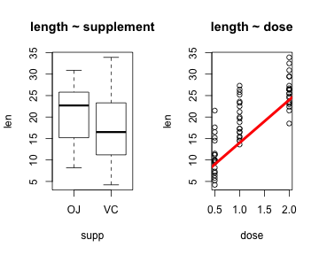
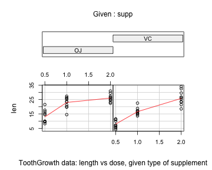

Tooth Growth Analysis
========================================================
### Author: Michael Downs


### Overview
This document looks at tooth growth based on a small (60 observations) sample of tooth lengths and two, possibly associated, factors: supplement and dosage. It is divided into three sections:
1. Exploratory analysis & data summary,
2. Hypothesis tests with confidence intervals, and
3. Conclusions & assumptions.

### 1. Exploratory analysis & data summary

```r
attach(ToothGrowth)

dim(ToothGrowth)
```

```
## [1] 60  3
```

```r
# look at fields
par(mfrow=c(1,2))
hist(len)      # tooth length. distribution may be normal w/ larger sample size. 
hist(dose)     # dosage in milligrams. three dosages. one for 20 samples each.
```

 

```r
               # supplement type (supp) is a categorical variable w/ 2 values: OJ, VC

# correlations
pairs(ToothGrowth) # evidence of relationship len~supp and len~dose. 
```

 

```r
# close up on relationships
par(mfrow=c(1,2))
plot(len~supp,main="length ~ supplement") 
plot(len~dose,main="length ~ dose"); abline(4,10,col="red",lwd=4)
```

 

```r
# relationship conditionality
coplot(len ~ dose | supp, data = ToothGrowth, panel = panel.smooth,
       xlab = "ToothGrowth data: length vs dose, given type of supplement")
```

 

### 2. Hypothesis tests with confidence intervals

Are supplement, dose and/or the combination of the two significant predictors of tooth length? The null hypotheseis ($H_0$) is that there is no relationship. The alternative hypothesis ($H_a$) is that there is a relationship. In the section below, I'll generate data used to evaluate the $H_0$ and $H_a$ for each predictor and combinations of predictors.


```r
# To reject the null hypothesis, we have to prove a statistically significant relationship between predictors (supplement and dose) and the response variable (len).

# 1. calculate the sample mean for tooth length
mean(len)
```

```
## [1] 18.81
```

```r
# 2. calcuate confidence intervals around the tooth length mean
ci_mn_2sd=mean(len)+c(-1,1)*qnorm(0.95)*sd(len)/sqrt(length(len)); ci_mn_2sd
```

```
## [1] 17.19 20.44
```

```r
ci_mn_3sd=mean(len)+c(-1,1)*qnorm(0.975)*sd(len)/sqrt(length(len)); ci_mn_3sd
```

```
## [1] 16.88 20.75
```

```r
# 3. calculate sample means for different supplements
sups=unique(supp)
sup_mns=NULL
for(i in 1:length(sups)){sup_mns[i]=mean(len[supp==sups[i]])}
sup_mns
```

```
## [1] 16.96 20.66
```

```r
# 4. calculate sample means for different doses 
doses=unique(dose)
dose_mns=NULL
for(j in 1:length(doses)){dose_mns[j]=mean(len[dose==doses[j]])}
dose_mns
```

```
## [1] 10.61 19.73 26.10
```

```r
# 5. calculate sample means for combinations of supplements and doses
oj_rcds=ToothGrowth[supp=="OJ",]
vc_rcds=ToothGrowth[supp=="VC",]
doses=unique(dose)
oj_dose_mns=NULL
vc_dose_mns=NULL
for(i in 1:length(doses)){
     oj_dose_mns[i]=mean(oj_rcds$len[oj_rcds$dose==doses[i]])
     vc_dose_mns[i]=mean(vc_rcds$len[vc_rcds$dose==doses[i]])
}
oj_dose_mns; vc_dose_mns
```

```
## [1] 13.23 22.70 26.06
```

```
## [1]  7.98 16.77 26.14
```

### 3. Conclusions & assumptions
Facts regarding the sample observations:
1. Mean tooth length is 18.8. 95% confidence interval (CI) is 17.2 to 20.4. 97.5% CI is 16.9 to 20.7.
2. Mean for all observations where supplement is OJ is 17. The mean for VC is 20.7.
3. Mean for all observations where dose is 0.5 is 10.6, dose 1.0 is 19.74, and dose 2.0 is 26.1.
4. OJ supplement means with 0.5, 1.0 and 2.0 doses are 13.23, 22.7 and 26.06, respectively.
5. VC supplement means with 0.5, 1.0 and 2.0 doses are 7.98, 16.77 and 26.14, respectively.

Conclusions:

1. Regarding supplements alone:
     (a) OJ is associated with below average tooth length at a 95% CI.
     (b) VC is associated with above average tooth length at a 95% CI.
     
2. Regarding doses alone: 
     (a) 0.5 is associated with below average tooth length at a 97.5% CI.
     (b) 1.0 is not, by itself, significant
     (c) 2.0 is associated with above average tooth length at a 97.5% CI.
     
3. Regarding combinations of supplements and doses:
     (a) 0.5 doses of both OJ and VC are associated with below average tooth length at 97.5% CI. Reject $H_0$
     (b) 1.0 doses of OJ and VC are associated with below and above average tooth length, respectively, at a 97.5% CI. Reject $H_0$.
     (c) 2.0 doses of OJ and VC are associated with above average tooth length at a 97.5% CI. Reject $H_0$.

Assumptions:

1. There is no control group i.e., where supplement and dose values are NULL. Therefore, one assumption is that these results are different from the control group and, therefore, worth analyzing. 

2. It's likely, that tooth length is a function of factors not included in the data set such as age of the tooth, size of the individual or even duration of the treatment. Therefore, one assumption is that there are no other missing or confounding variables. 

3. For conclusion #3 above, I've looked at combinations of supplement and dose. The assumption here is that dosage relates specifically and exclusively to the amount of supplement administered. If this assumption is not valid, only conclusions #1 and #2 stand. 
